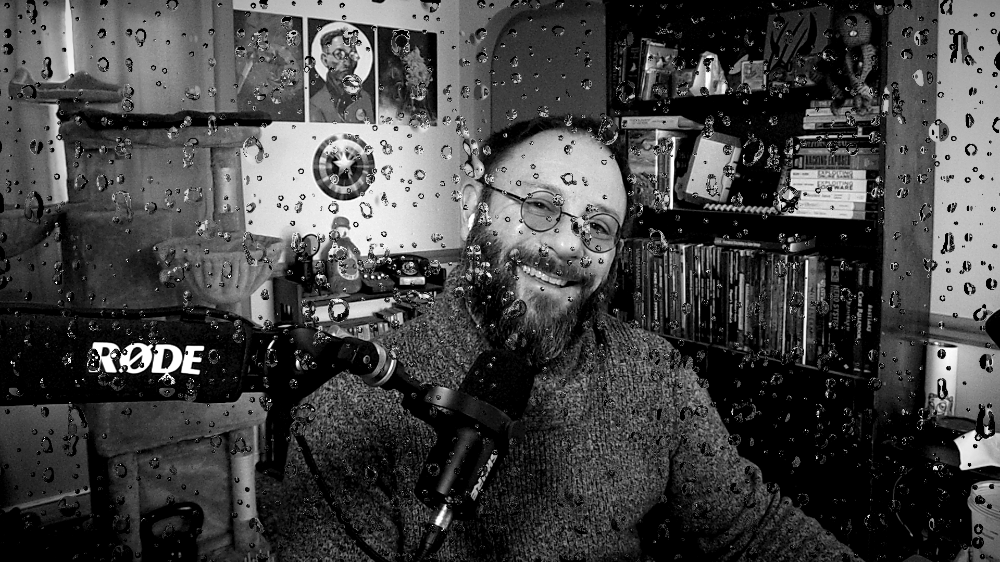

# Shaders for the obs-shaderfilter plug-in

I'm a big fan of OBS and I really enjoy using the [obs-shaderfilter
plugin](https://obsproject.com/forum/resources/obs-shaderfilter.1736/) and really wanted more
shaders, as well as the ability to play with the ones I had. So, why not share my efforts?

Everything under `shaders/` is under variations of the Creative Commons licensure, so feel free to
pull any or all of them down as you like and load them into your own production. Enjoy!

## Showcase

Full resolution screen caps of these and other shaders under the `/showcase` folder.

### Kaleidoscope


### Rainy Lens



### Warpspeed


## Acknowledgements

Special thanks to SkeletonBow. Withtout their overwhelming contributions, this guide wouldn't have
been possible. Find them [on Twitch](https://twitch.tv/skelzinator).

Shaders in OBS wouldn't really be accessible to most of us without the mighty plugin author
[Exeldro](https://github.com/exeldro) and the obs-shaderfilter project.

And thanks to the authors of these shaders on Shadertoy and elsewhere. I don't really know how to
write my own yet, but the only way I'll get there is studying a lot of these.

## Usage

**NOTE LICENSING** and make sure it conforms to your production. You'll need to install the
[obs-shaderfilter](https://github.com/exeldro/obs-shaderfilter/releases) plugin (2.4.1 or later) and
load these as you would any other shader. I recommend [Nutty's
video](https://www.youtube.com/watch?v=1WidFdW-yNo) on how to get it setup and how to work with it,
if you're unfamiliar.

Personally, I drop these shaders into a folder next to the `/examples` folder so they're easy to
find, but I'm not the boss of you! Do what works easiest for you!

## Licensing and Usage of these Shaders

Check eash shader file's header for its specific licensing and permissions. Almost all of them are
CC-SA Non-Commercial. So, don't sell the shaders, give credit when using them, and keep sharing em,
especially if you make modifications.

Most shaders here are from Shadertoy and thus are subject to their
[default protections](https://www.shadertoy.com/terms),
[CC BY-NC-SA 3.0](https://creativecommons.org/licenses/by-nc-sa/3.0/deed.en),
unless stated otherwise. (Again, check their headers.)

## On Converting GLSL Shaders to OBS's implementation of HLSL

This guide is intended to serve as a light reference for converting existing Shadertoy or GLSL
shaders into OBS's implementation of HLSL, for use with the [obs-shaderfilter
plugin](https://obsproject.com/forum/resources/obs-shaderfilter.1736/) v2.4.1+.

If you found a really cool shader on Shadertoy.com or in StreamFX or elsewhere and you'd like to use
it in your OBS production, these notes may help you do that. I'll keep uploading examples (which
you're free to download and use if you like!) as I do conversions myself, as well as updating this
guide as I learn more.

This is not a guide to teach you how to write shaders or even to ease the passage into learing any
of the shader langauges. This is, at best, a quick reference for folks who are familiar with the
space, or at least, unafraid. Be not afraid! You can do this!

### Put a comment at the top

Start every source with a comment of some kind; OBS will crash if the first line is a preprocessor
directive, and this will work around it.

### mainImage entry point

In GLSL the definition for `mainImage` takes two parameters and returns nothing; the return value is
effectively packaged in the `fragColor` parameter. It looks like this:

```glsl
void mainImage( out vec4 fragColor, in vec2 fragCoord )
{
    // sick shader code goes here
    fragColor = the_cool_color_you_made_for_this_specific_pixel;
}
```

Here in OBS's HLSL, fragCoord is replaced with v_in (see next section) and the fragColor is simply
the return value, so you can just return it after creating and assigning it.

```cpp
float4 mainImage(VertData v_in) : TARGET
{
    // sick shader code goes here
    return the_cool_color_you_made_for_this_specific_pixel;
}
```

If you forget the `: TARGET` you'll get the following error:

```text
'main': function return value missing semantics
```

### fragCoord and OBS's UV origin

OBS's HLSL implementation has the origin at the bottom-left, as opposed to GLSL's top-left origin.
To account for this, if y-axis orientation matters for your shader, you'll need to handle that axis inversion.

In general, `fragCoord` is replaced with `v_in.pos`.

Here's a convenience function I took to using:

```cpp
float2 transform_and_normalize_uv(float2 pos) {
    // pass this v_in.pos
    // Moves origin to screen center, normalizes [-1., 1.] and  flip y-axis to behave like GLSL
    float2 fragCoord = float2(pos.x, uv_size.y - pos.y); // flip y-axis
    float2 uv = fragCoord / uv_size.xy; // normalize coordinates to [0,1].
    uv = uv * 2.0 - 1.0; // map to -1, 1
    uv.x *= uv_size.x / uv_size.y; // stretch aspect ratio for x to compensate
    return uv;
}
```

### Handy pre-defines

If the file contains any of these functions, use the associated `#define` or replace each GLSL
method reference with its HLSL equivalent.

```hlsl
#ifndef OPENGL
#define mat2 float2x2
#define mat3 float3x3
#define fract frac
#define mix lerp
#endif
```

### vecN is floatN

In general, if you encounter vector constructions, replace it with float like this:

```cpp
vec3(1.0, 2.0, 3.0);
// becomes
float3(1.0, 2.0, 3.0);
```

Note that the convenience definition `vec3(0.0) == vec3(0.0, 0.0, 0.0)` does not work in OBS and
will beget you the following error message:

```text
"Incorrect number of arguments to numeric-type constructor."
```

You just need to explicitly add all of the values to fix this.

### There is no const

Replace `const` with `#define` preprocessor directives, or you can use `uniform<>` if you want to
surface it in the OBS UI for user adjustment.

#### const becomes define

```cpp
const int STEPS = 8;
// becomes
#define STEPS 8
// note the #define doesn't take a type, operator, or semi-colon.
// it's effectively just string replacement in the code that follows it.
```

### Use uniform so the end-user can make fun adjustments

Surface constants to the OBS UI using the `uniform` keyword and angle brackets syntax. Examples follow.

#### Single number field with default value.

```cpp
uniform float value = 0.0;
```

#### Color selection dialog

```hlsl
// Note the {} braces.
uniform float4 primary_color<
    string label = "Primary";
> = {0.0, 0.0, 0.0, 0.0};
```

#### Slider

```hlsl
uniform float glow_scale<
    string label = "Glow Scale";
    string widget_type = "slider";
    float minimum = 0.0;
    float maximum = 10.0;
    float step = 0.01;
> = 2.0;
```

### modulo calculations

HLSL doesn't have `mod()` but it does have `fmod()` which is probably not what you want to GLSL's replace
`mod()` with.

GLSL's `mod(x, y)` returns the remainder after division but ensures that the result has the same
sign as the divisor.

HLSL's `fmod()` uses `trunc()` and the result takes the same sign as the dividend, as it does in
C/C++.

If you want GLSL's behavior, use a `#define` or proper function or otherwise do it yourself thus:

```cpp
#define mod(x,y) ((x) - (y) * floor((x)/(y)))
```

### GLSL's atan() -> HLSL's atan2()

GLSL's `atan(y,x)` is handled with HLSL's `atan2(x,y)` for the same behavior. (Note the `2` and that
the arguments are reversed.) Beware that HLSL also has `atan()` which takes only one argument which
is effectively y/x, but note it will not be correct in all quadrants. (Just use `atan2()`.)

### Arrays can't be function parameters

Arrays can't be passed into functions in OBS's implemenation of HLSL. If you encounter code doing
this, make the array global in scope or otherwise avoid passing it at all by refactoring the code.

### Matrix maths

In GLSL, matrices are row-major by default for multiplication. In HLSL, they're column-major by
default. Because the default multiplication and storage order differ, you'll often need to make
adjustments by hand to account for these differences. (You may have to transpose the matrix.)

```glsl
// In GLSL
vec4 result = vec4 * mat4;
```

```cpp
// In HLSL, use mul() instead of * and order the matrix before the vector
float4 result = mul(mat4, vec4); // Matrix is on the left in HLSL
```

NOTE that HLSL allows the programmer to explicitly set matrix storage order with the `row_major` and
`column_major` keywords, however it's not known to me whether this is supported in OBS's
implementation. (I haven't tried it. Let me know if you do.)

### iChannelN, texelFetch, and textureLod

In GLSL, iChannelN (where N is 0, 1, 2, etc.) represents an input texture or buffer, which is
ShaderToy specific, I believe. I _think_ I've seen shaders that essentially do this but will need to
find them to clarify this section and my understanding.

One example I saw recently is shown in `webs.shader` here in this repo. I was able
to replace specificaly this:

```glsl
float fft  = texelFetch( iChannel0, float2(.7,0.), 0 ).x;
```

with this:

```cpp
float fft = image.Sample(textureSampler, v_in.uv).x;
```

- `image` is a Texture2D object bound to the shader in OBS.
- `.Sample()` performs filtered sampling on the given texture at the given UV coordinates.
- `textureSampler` is a SamplerState object which defines how textures are sampled. This handles
  _how_ `image` is sampled.
- `image.Sample(textureSampler, v_in.uv)` is the current input texture being processed by the
  shader. If applied as a filter to a source (image, capture) then `image` refers to that source; if
  applied to the entire scene, `image` represents the full composited scene before the shader runs.

Another example in `rainy-window.shader` that samples the current scene. In GLSL:

```glsl
// notes:
// UV is aspect-corrected fragCoord.xy
// n is a float2 with the x and y normals
// focus is a float for detail level
float3 col = textureLod(iChannel0, UV+n, focus).rgb;
```

That loads from the texture in iChannel0 at mipmap level UV+n with detail-level focus (a float). To
accomplish this in HLSL for OBS I used `image.SampleLevel()`:

```cpp
float2 flippedUV = float2(UV.x, 1.0 - UV.y); // had to flip y-axis here
float3 col = image.SampleLevel(textureSampler, flippedUV + n, focus).rgb;
```

As I learn more, I'll add more here.

### Noise Generation

Many Shadertoy shaders I've seen use a pregenerated noise image that they reference. This can be
done with obs-shaderfilter (via a `uniform texture2d`) but for simplicity I've taken to using simple
in-shader noise generation. By nature this is inferior to the image technique, but it works well
enough in my experience. I've taken to using a Golden Ratio indexer, adapted from [this
StackOverflow post](https://stackoverflow.com/a/28095165/19677371).

```cpp
// Gold Noise ©2015 dcerisano@standard3d.com
// - based on the Golden Ratio
// - uniform normalized distribution
// - fastest static noise generator function (also runs at low precision)
// - use with indicated fractional seeding method.

float gold_noise(float2 xy, float seed){
    float phi = 1.61803398874989484820459; // Φ = Golden Ratio
    return frac(tan(distance(xy*phi, xy)*seed)*xy.x);
}
```

You can see this in-use in `space-travel.shader`, where I also use a somewhat more complicated hash
method from that same StackOverflow page as the seed. (You could also use `elapsed_time` for a seed,
or the color value of the screen, or whatever you like.) _This is still being tested._

### Cap to 60 FPS

If you use this on time-based updates (or link ot to update maths otherwise) this can hold a current
frame mostly static, reducing or elimating changes, which is better for compression and thus better
for networking. In the examples I use it in, that's all it will do; other calculations will still be
happening, so the GPU will still be working. Still, my bottleneck recently was (believe it or not)
network bandwidth, so I'm trying this.

```cpp
float limited_time() {
    float target_fps = 60.0;
    float frame_time = 1.0 / target_fps;
    return floor(elapsed_time / frame_time) * frame_time;
}

// use time instead of elapsed_time or iTime
#define time limited_time()
```

### Add documentation

If you want to have notes visible within the OBS UI, you can define a string constant as a uniform
like this:

```cpp
uniform string Notes<
    string label = "Info!";
    string widget_type = "info";
> = "This message will be visible in the OBS obs-shaderfilter UI once the shader is loaded.";
```

### Quick Reference

When you encounter the following keywords or operators in a GLSL shader you're trying to convert, replace them thus:

| replace                     | with                           | notes                                                           |
| --------------------------- | ------------------------------ | --------------------------------------------------------------- |
| `flt_a * matrix_b`          | `mul(flt_a, matrix_b)`         | Use `mul()` for matrix multiplication. Mind row vs col major.   |
| `atan(y,x)`                 | `atan2(x,y)`                   | Arguments reversed here in HLSL.                                |
| `dFdx()` and `dFdy()`       | `ddx()` and `ddy()`            |                                                                 |
| `fract()`                   | `frac()`                       |                                                                 |
| `fragCoord`, `gl_fragCoord` | `v_in.pos`                     | The y-axis is inverted here from GLSL, see associated section.  |
| `iResolution`               | `uv_size`                      | The y-axis is inverted here from GLSL, see `fragCoord` section. |
| `iTime`                     | `elapsed_time`                 |                                                                 |
| `matN`                      | `floatNxN`                     |                                                                 |
| `mix()`                     | `lerp()`                       |                                                                 |
| `texelFetch(t, v, m)`       | `image.Sample(textureSampler)` | See associated section.                                         |
| `vecN`                      | `floatN`                       | `float4(0.,)` must be replaced with `float(0.0, 0.0, 0.0, 0.0)` |
